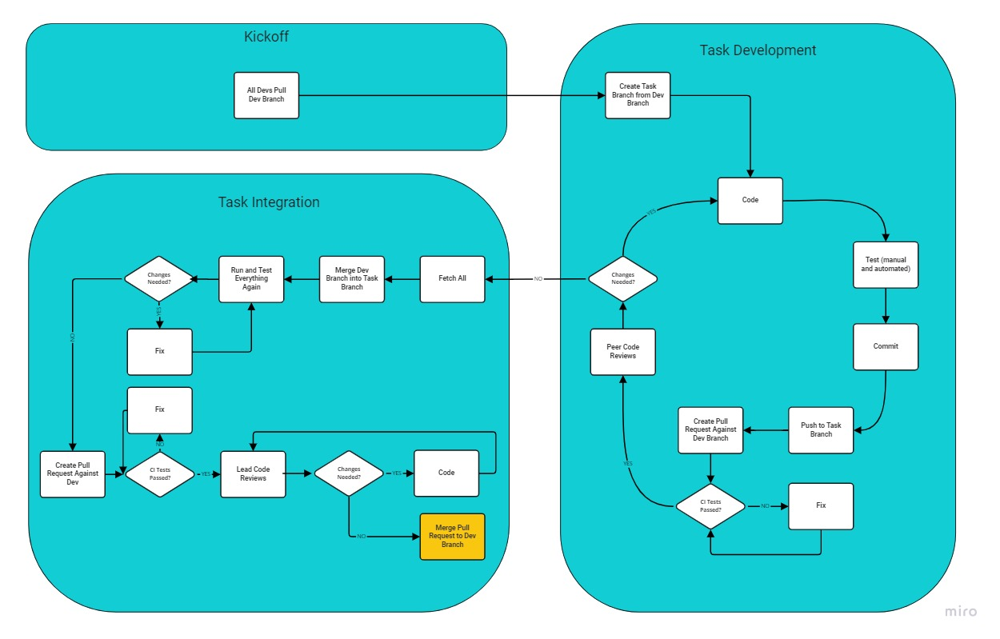

## Definition of Done

Wanna contribute and merge your work?  Every github pull request (PR) will include a list of completion criteria.  See the [Definition of Done](./docs/pull_request_template.md) template for details.  

## Git Workflow

When a large team works on a project together, it's important to keep your branch up to date and merge regularly.  Follow the steps below to avoid last-minute merge conflicts.

1. Create a new branch for your task.
2. Code and thoroughly test your feature (with automation or manually).
3. Commit to your branch regularly.
4. Push your branch to origin.
5. Create a PR on Github **_against the dev branch_**.
6. On the PR page, check the results of the CI (continuous integration) tests.  Fix any issues.
7. Move your Github Issues task ticket into the review column.
8. Ask a teacher for a code review and fix any issues.  Retest your feature.
9. After a teacher reviews and approves your PR, **_merge it to dev_**.
10. Siiiiiick!
11. Great success!

Flow Diagram

This diagram includes task development and task integration flows.  The main difference is that Task Integration includes a merge from dev into your task branch.

**Changes**
* __Only one PR is required pr branch.__
* __Note that there is no need for peer reviews (from other developers) on this project.__

## Merge Conflicts

In a large team, it is quite likely that you will run into merge conflicts in Github PRs.  Here's how you can resolve them.

1. Pull origin's **_dev_** branch directly into your branch.  This begins a merge.
2. In VSCode, resolve merge conflicts file-by-file.  Ask for help from other devs who's work is affected if needed. 
3. After all conflicts are resolved, **_retest your feature_**.
4. Make the merge commit.
4. Push your merged branch (not the dev branch) to origin.
6. Ask devs who's work might be affected to review your PR, check for accidental deletions.
5. Revisit your PR and **_merge back to dev_**.

## Code Issues to Look-out For

This is certainly not an exhaustive list, but here are some things to look out for when submitting code for reviews.

1. `// TODO / FIX / TEMP` - Either do the thing or remove the comment.
2. Commented out code - remove it.
3. Non-conventional naming and spelling mistakes - correct them.
4. Lengthy conditional logic, eg: `if / else if / else if / else`, etc.  Could this be made eaiser to read with a switch statement?  Could it be refactored into smaller functions?
5. Non-reachable logic, eg: `if(true) { // Do something } else { // Non-reachable code }`.
6. Not separating concerns, eg: a module called pokemonDataHelper that includes logic for dealing with pokemon data, but also functions for converting timestamps to human-readable dates.  In that case, it might make sense to move the date conversion code to another helper called timeDateHelper.
7. Variables that are not used.
8. Packages in package.json - are they correctly installed as produciton or dev dependencies?  Are any new packages actually used?
9. Consistent use of CSS throughout, eg: vanilla CSS or tailwind.
10. Duplicated code, Don't Repeat Yourself (DRY).

